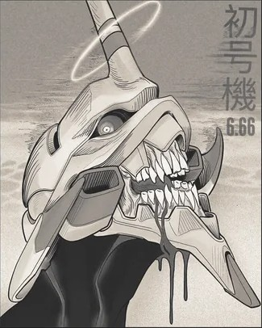
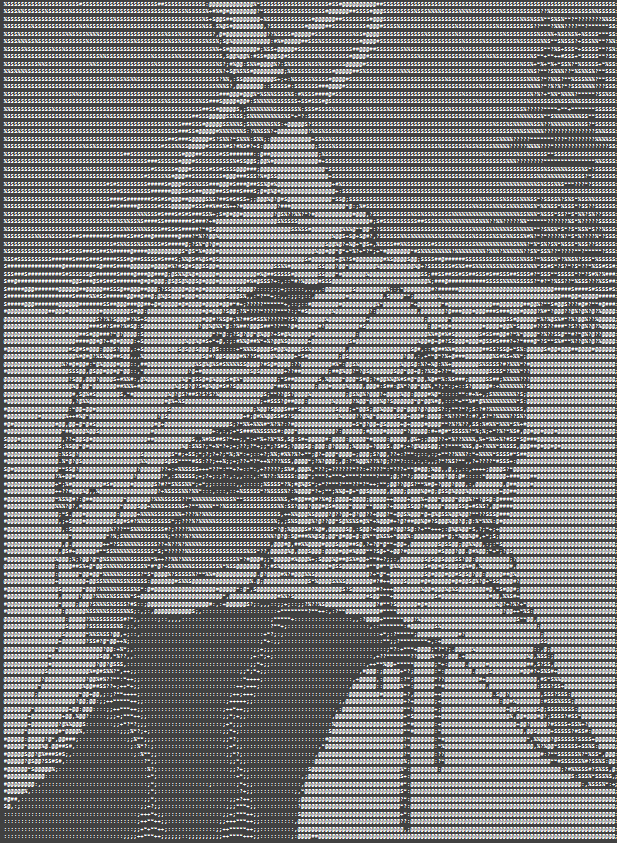
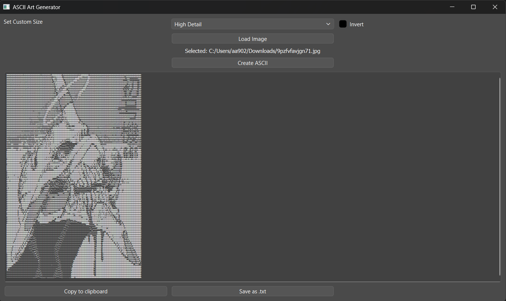

# ASCII Art Generator (Qt)

A simple desktop application (under construction) built with Qt and C++ to convert images into ASCII art!

## Features
- Load Images (PNG, JPG, JPEG, WebP)
- Adjustable Presets
- Invert Brightness option
- Copy to clipboard
- Export ASCII as '.txt' file

## How it works

The application converts each pixel's brightness into ASCII characters, mapping dark pixels to dense characters and light ones to sparse characters and vice versa if inverted

<p float="left">

</p>
## Presets
- High Detail: 180 Characters wide
- Balanced: 100 Characters wide
- Terminal: 60 Characters wide (Originally made for this lol)

## How to use
1. Click "Load Image"
2. Select the image file you want to convert
3. Choose Preset "High Detail, Balanced, Terminal" (Balanced by default)
4. Enable Invert if you want
5. Click Create ASCII
6. "Copy to clipboard" or "Save as .txt"


## Clone the Repository

```bash
git clone https://github.com/RemTheGem/ascii-art-generator.git
```
